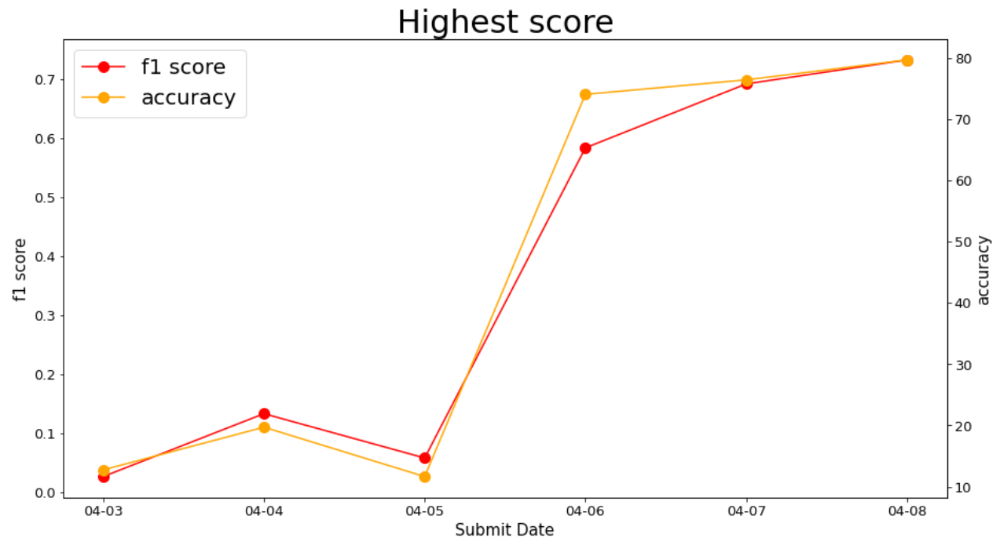
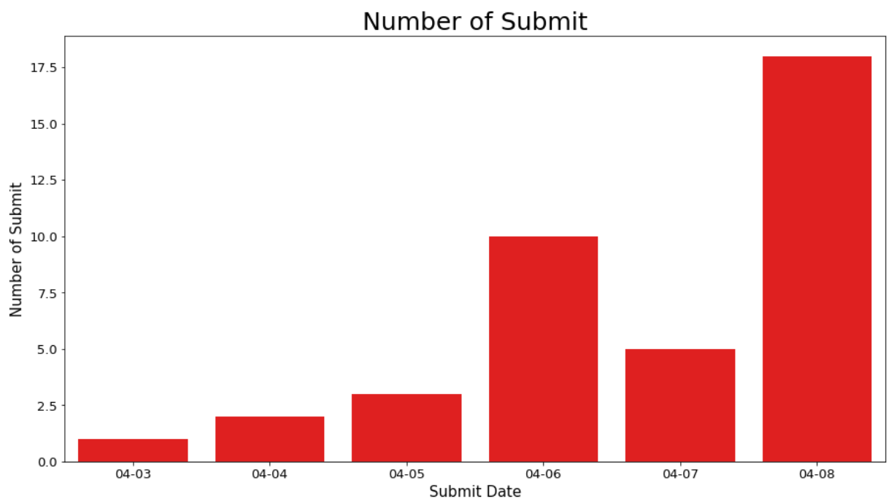

# p1-img-JaegyeongByun

## 📝 대회 소개
- 대회 제목 : 마스크 착용 상태 분류
- 문제 유형 : muti-classfication
- 평가척도 : F1-Score

	
## 🎁 데이터 소개 (데이터 비공개)
- 전체 사람 명 수 : 4,500
- 한 사람당 사진의 개수: 7 [마스크 착용 5장, 이상하게 착용(코스크, 턱스크) 1장, 미착용 1장]
- 이미지 크기: (384, 512) 고정

## 📁 File structure
	- EDA
		-.ipynb
		-...
	- baseline
		- model.py
		- loss.py

## 🚀 Baseline code 
dataset.py
- 마스크 데이터셋을 읽고 전처리를 진행한 후 데이터를 하나씩 꺼내주는 Dataset 클래스를 구현한 파일입니다.

loss.py
- 이미지 분류에 사용될 수 있는 다양한 Loss 들을 정의한 파일입니다

model.py
- 데이터를 받아 연산을 처리한 후 결과 값을 내는 Model 클래스를 구현하는 파일입니다.


train.py
- 실제로, 마스크 데이터셋을 통해 CNN 모델 학습을 진행하고 완성된 모델을 저장하는 파일입니다.

inference.py
- 학습 완료된 모델을 통해 test set 에 대한 예측 값을 구하고 이를 .csv 형식으로 저장하는 파일입니다.

evaluation.py
- inference.py를 통해 나온 예측 값 파일을 GT 와 비교하여 score 를 산출하는 파일입니다

##  :information_desk_person: 사용법

1. 모델의 추론에 필요한 라이브러리를 설치합니다
```pip install -r requirements.txt```

2. inference.py 파일을 이용하여 학습된 모델의 예측값을 산출합니다

    파일의 실행 형식은 다음과 같습니다

    ```SM_CHANNEL_EVAL=[dataset dir] SM_CHANNEL_MODEL=[model saved dir] SM_OUTPUT_DATA_DIR=[inference output dir] python inference.py --model [your model class]```

    SM_CHANNEL_EVAL: 평가 데이터셋이 위치하는 폴더

    SM_CHANNEL_MODEL: 학습된 모델(best.pth) 가 위치하는 폴더

    SM_OUTPUT_DATA_DIR: 모델의 예측값을 csv 파일로 저장하는 폴더

    (optional) model: Custom Model 를 통해 학습을 진행하였을 경우, 해당 모델의 이름
    위 형식으로 실행하면 SM_OUTPUT_DATA_DIR 폴더에 테스트 셋의 예측값이 submission.csv 이름으로 저장이 됩니다


## 리더보드 점수 표로!



With @areum514
